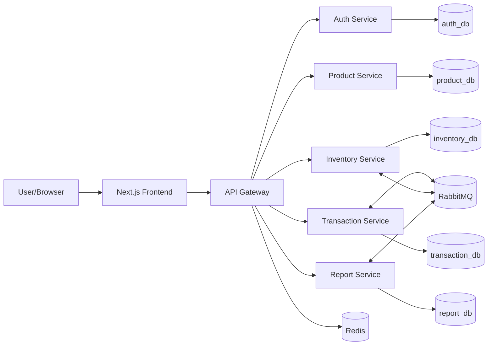

# Kiến trúc hệ thống

## Sơ đồ microservice

## Luồng request

1. Người dùng gọi Frontend.
2. Frontend gửi request tới API Gateway.
3. Gateway kiểm tra JWT, role và route tới service nội bộ.
4. Service xử lý nghiệp vụ với database riêng.
5. Các nghiệp vụ thay đổi tồn kho phát event qua RabbitMQ.
6. Report Service consume event để tạo dashboard/snapshot.

## Nguyên tắc tách service

- Không service nào truy cập database của service khác.
- Dữ liệu liên service dùng ID tham chiếu và API/event.
- Gateway là biên bảo mật; service nội bộ vẫn có thể validate JWT defense-in-depth.
